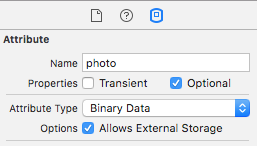

# iOS Northwind Database Project

### Temat projektu
Celem projektu jest zaimplementowanie systemu realizującego wybrane podstawowe operacje w przykładowej bazie Northwind w wybranej technologii.

### Ustalenia poczatkowe i scope projektu
Operacje CRUD na wybranych tabelach
Operacje składania zamówień na produkty 
Operacje wyszukiwania informacji i raportowania (realizacja złożonych operacji SQL)
itp.
Należy zwrócić uwagę na sposób i wydajność realizacji operacji bazodanowych (np. przedstawić wyniki pomiarów wydajnościowych)

Ważnym elementem projektu jest prezentacja technologii w której realizowany jest projekt, dokumentacja powinna mieć formę przewodnika (tutorialu) po danej technologii (przewodnik ilustrujący jak należy programować elementy systemu bazodanowego - na przykładzie bazy Northwind), przewodnik powinien zawierać opis wraz z elementami kodu

Dokumentację należy prowadzić na bieżąco (wiki)
Kod powinien być dostępny w repozytorium (svn, git)
Ostateczną wersję projektu należy oddać w formie w pełni skonfigurowanej maszyny wirtualnej (vmware lub virtualbox)
Technologia realizacji projektu do uzgodnienia z prowadzącym

Technologie:
Aplikacja mobilna, iOS
Core Data

### Core data introduction

Core Data is a framework that you use to manage the model layer objects in your application. It provides generalised and automated solutions to common tasks associated with object lifecycle and object graph management, including persistence.

Core Data can serialise objects into XML, Binary, or SQLite for storage.

### Application Vision

The application serves managers of magazines and shops with their day to day duties. It allows:
1. Checking list of products
2. Changing products details
3. Checking new orders from clients
4. Adding an order


### Application Flow
Application flow corresponds to magazine employe work.

*New order from client:*
Client calls to employe -> Employee will add a new order -> Employee will execute order

*Views in application:*
1. Select Flow of work View (Products / Orders / Categories)
2. Product List
3. Orders List
4. Categories List
5. Product Details
6. Order Details
7. Categories Details

*Sample flow of work:*
1. Execute order: Employee opens the app and goes to *New Orders View*. He selects an order and checks if all order components are available. Then he taps execute button to execute the order.

2. Change product details: Employee opens the app and goes to *Products List View*. He uses search to find a specific product. He opens ~Product Details View~ where he is able to change details and save.


### Technology

*iOS application* is built it on top of Apple frameworks:
1. Core Data
2. Foundation
3. UIKit

*Database* scheme is built on top of Northwind Database (a sample database that is shipped along with Microsoft Access application).


### Logging
If you want to see underylying SQLite calls that CoreData is making on your behalf, you must enable CoreData logging. To do so, you must edit your Run scheme by adding two arguments passed on launch.

```
-com.apple.CoreData.SQLDebug 3
-com.apple.CoreData.Logging.stderr 1
```


### Going deeper - External Storage

As you probably know, storing large binary data in SQL database is not sufficient. However, it would be really helpful to store images and videos in our database just like any other piece of data, rather than manually managing file paths, deletions, redos etc.
Core Data External Storage comes to the rescue!
If one of your entity's attributes has type `Binary Data`, you will see an option in Attributes Inspector called `Allows External Storage`. 

When checked, Core Data will transparently decide whether this piece of data should be stored in the SQLite database or as a external file on disk and keep reference to it.
All of that happens transparently.
Don't believe? Let's check.

We've checked that option on `photo` attribute in `Employee` entity.
Then, we downloaded app data and inspected sqlite database.
Here's how it looks like:

You will notice that the last value in the row is some kind of identifier. We've never set it so where does it come from?

When you list all the files in the directory where database is located, you will find a hidden directory. Let's see what's inside it.


Surprise! We've just found some binary files saved there using the same identifiers. If you change extensions of those files to eg .png, you will find out that those are exactly the same images we set as an employee's photo :)
